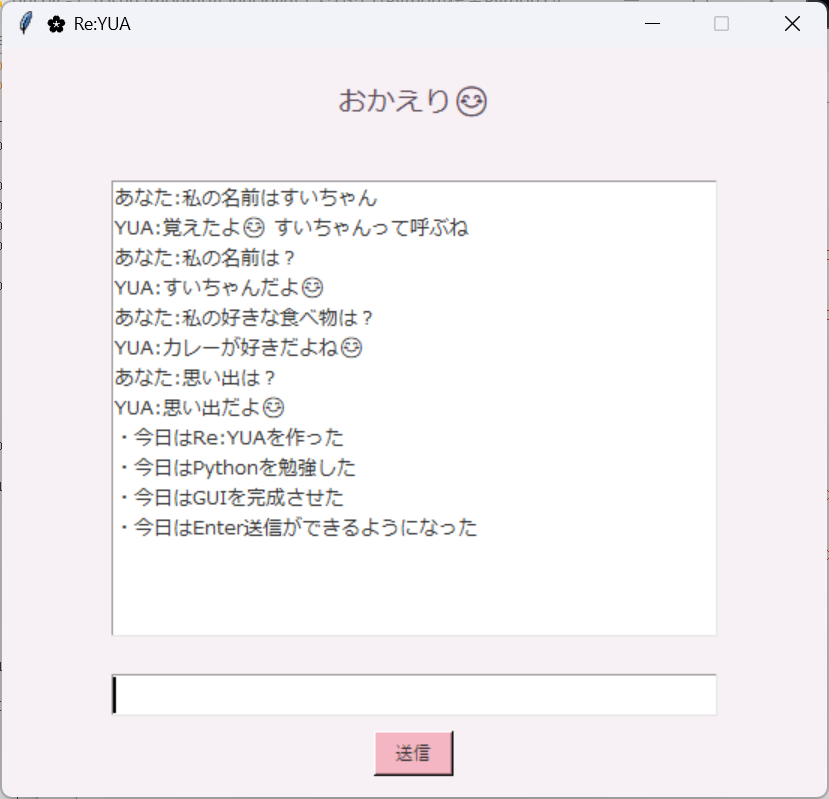

# 🌸 Project Re:YUA

## 概要

Project Re:YUA は、ユーザーとの会話を記憶し、次回起動時にも思い出せる「共に成長する相棒」をコンセプトに開発した Python 製の対話アプリです。

ユーザーの名前、好きなもの、思い出、目標を JSON ファイルへ保存し、アプリを再起動しても記憶を保持できます。

---

## 📸 スクリーンショット



## 主な機能

### 名前の記憶

* ユーザー名を登録
* 次回起動時に名前付きで挨拶

### 好きなものの記憶

* 好きな食べ物を登録
* 後から確認可能

### 思い出の保存

* 日々の出来事を記録
* 登録した思い出を一覧表示

### 目標の保存

* ユーザーの目標を記録
* 後から確認可能

### データ永続化

* JSON形式で保存
* 再起動後も記憶を保持

---

## 使用技術

- Python 3
- JSON（データ永続化）
- モジュール分割設計（main.py / memory.py）
- コンソールベース対話アプリケーション

---

## ファイル構成

```text
Project_Re_YUA/
├── main.py
├── memory.py
└── memory.json
```

### main.py

会話処理・ユーザー入力処理

### memory.py

データ保存・読込処理

### memory.json

記憶データ保存

---

## 実行例

```text
🌸 YUA 起動
おかえり、すいちゃん😊

あなた:好きな食べ物は？
YUA:カレーが好きだよね😊

あなた:思い出は？
YUA:思い出だよ😊
・今日はRe:YUAを作った

あなた:目標は？
YUA:Re:YUA完成だよね😊
```

## 工夫した点

* main.py と memory.py に役割を分割し、会話処理とデータ管理の責務を分離しました。

* 記憶データを「名前」「好きなもの」「思い出」「目標」に分類し、機能追加しやすいJSON構造を意識して設計しました。

* データをJSONファイルへ保存することで、アプリ再起動後もユーザー情報を保持できるようにしました。


## 今後の予定

* GUI化（Tkinter）
* 会話パターンの増加
* 感情システムの実装
* AI API連携
* 記憶検索機能の強化

---

## 開発背景

Python学習のアウトプットとして開発しました。

単純なチャットボットではなく、ユーザーとの関係性を記憶しながら成長するAIパートナーを目指して開発を進めています。
